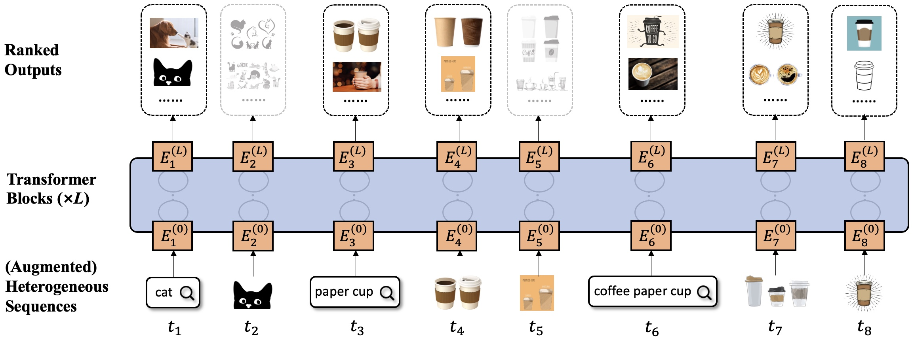

# Query-Aware Sequential Recommendation

MAIN IDEA: Use *user queries* to prunctuate and enrich *interaction sequences*!



This is the pytorch implementation of this paper [Query-Aware Sequential Recommendation.](https://cseweb.ucsd.edu/~jmcauley/pdfs/cikm22c.pdf) 

Zhankui He, Handong Zhao, Zhaowen Wang, Zhe Lin, Ajinkya Kale, Julian McAuley. 31st ACM International Conference on Information and Knowledge Management, CIKM 2022, short paper track.


## Dependencies

We use python 3.6 and other python dependencies can be installed with `pip install -r src/requirements.txt`.

## Quick Start

Try datasets `diginetica` or `unsplash` on our `Query-SeqRec` model, e.g.:

```
bash script/{diginetica,unsplash}/query_seqrec.sh 0
```


Try datasets `diginetica` or `unsplash` on baseline `SASRec` model, e.g.:

```
bash script/{diginetica,unsplash}/sasrec.sh 0
```


## Bibtex

Please cite our paper if using this code, and feel free to contact [zhh004@eng.ucsd.edu](zhh004@eng.ucsd.edu) if any questions.

```text
@inproceedings{he22query,
  title = "Query-aware sequential recommendation",
  author = "Zhankui He and Handong Zhao and Zhaowen Wang and Zhe Lin and Ajinkya Kale and Julian McAuley",
  year = "2022",
  booktitle = "CIKM"
}
```
